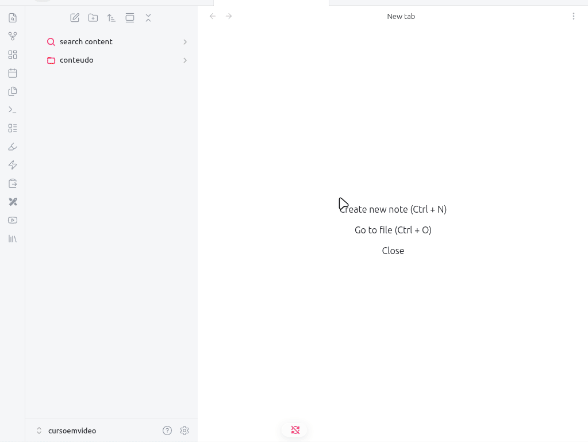

# Obsidian Gallery View Dashboard

A powerful, visual gallery plugin for Obsidian that transforms your vault folders into a beautiful, navigable dashboard. Organize your resources, courses, and media with custom banners and intuitive folder structures.

## Preview


## 🚀 Features

* **Dynamic Dashboard View:** Browse your vault as a visual library with custom banners.
* **Hierarchical Navigation:** Seamlessly move between subfolders and files with an integrated navigation system.
* **Customizable Banners:** Set unique banner images for folders and individual notes.
* **Metadata Integration:** Display file metadata (like status or tags) directly on library cards.
* **Quick Action Checkboxes:** Manage task statuses directly from the library view.
* **Live Settings Sync:** Instant updates to your library structure without needing to reload.
* **Smart Folder Suggestion:** Auto-complete path selection for easy configuration.

## ⚙️ Setup

1.  Open **Settings** > **Gallery Dashboard**.
2.  Set your **Library Root Target Path** (e.g., `conteudo/cursos`).
3.  Configure your **Visible Metadata Keys** to see your frontmatter properties.
4.  Use the **Live Library Vault Tree** section to assign custom banners to specific folders.
5.  Add **Manual Customizations** for specific overrides.

## 🖼️ How to use

* **Browsing:** Click any folder card to enter it, or click a file card to open the note.
* **Navigation:** Use the "Back" button in the gallery toolbar to return to the parent folder.
* **Customization:** Edit banners via the plugin settings to match your vault's theme.

---

## 🛠️ Development

This plugin was built using the [Obsidian Plugin API](https://github.com/obsidianmd/obsidian-api).

### Build
```bash
npm install
npm run build